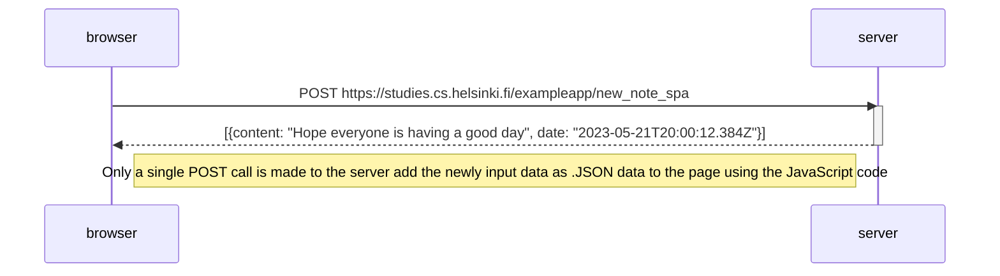

```mermaid
sequenceDiagram
    participant browser
    participant server

    browser->>server: POST https://studies.cs.helsinki.fi/exampleapp/new_note_spa
    activate server
    server-->>browser: [{content: "Hope everyone is having a good day", date: "2023-05-21T20:00:12.384Z"}]
    deactivate server

    Note right of browser: Only a single POST call is made to the server add the newly input data as .JSON data to the page using the JavaScript code
```